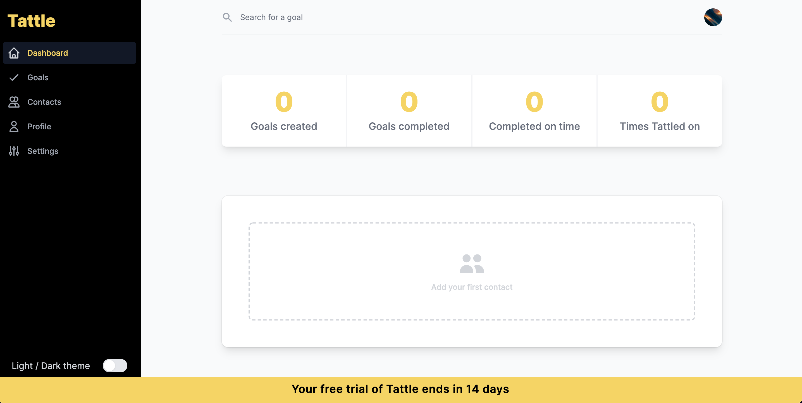
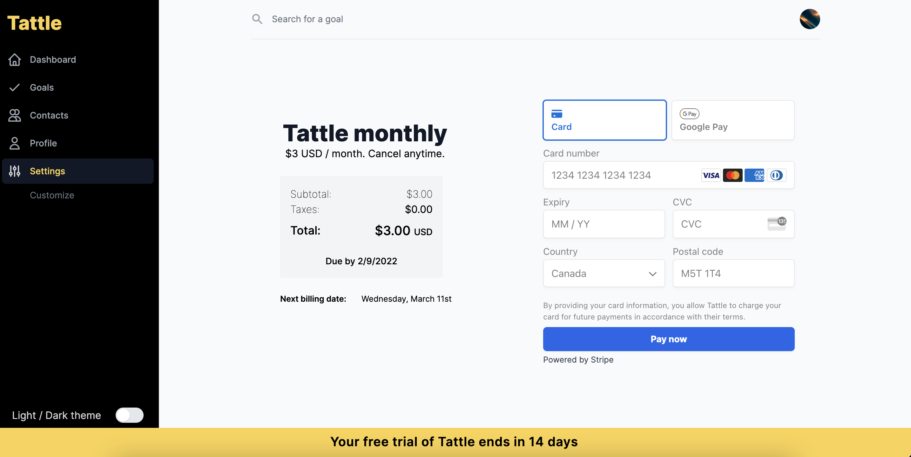
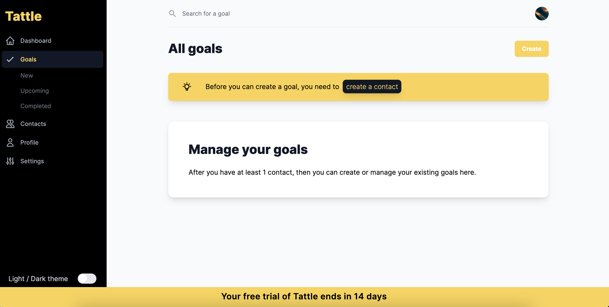
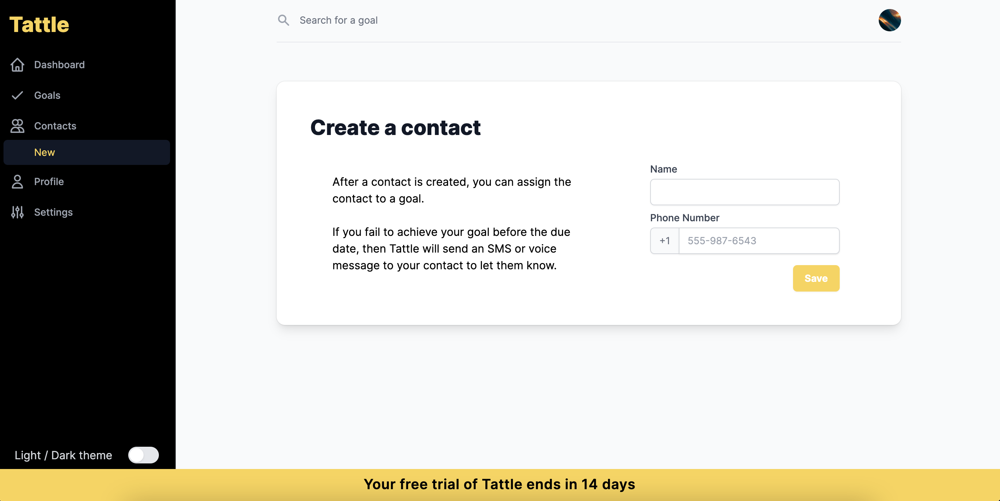
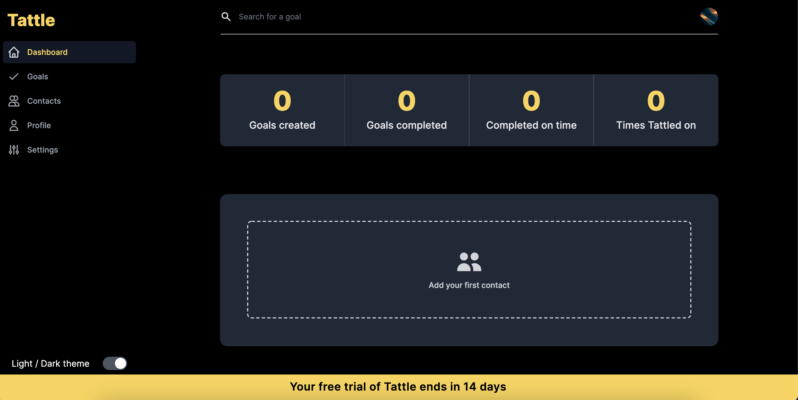

# Tattle
Tattle is a full stack goal tracking and accountability app, with a bit of a twist. If you don't achieve your goal, we'll tattle on you. We'll give your mom a ring, or send her an SMS (your preference, of course) to let her know of your disappointment. 

Don't want to rope dear old mom into this? Use any phone number you want, just pick someone that will help keep you accountable.

### Using this repository
This repo contains the code for the Tattle marketing website, as well as web app, which can be logged into via the marketing site. The marketing website lives in the `pages/` directory. The app resides in the same `pages/` directory, in the `app/` folder.

_Coming soon: Tattle also offers a native iOS and Android app, though the codebase is stored separately, in the [`tattle-native`](https://github.com/sandypockets/tattle-native) repo._

### Contents
- [Features](https://github.com/sandypockets/tattle#-features)
- [Tech stack](https://github.com/sandypockets/tattle#-tech-stack)
- [Getting started](https://github.com/sandypockets/tattle#-getting-started)
  - [Set up Supabase](https://github.com/sandypockets/tattle#set-up-supabase)
  - [Set up Stripe](https://github.com/sandypockets/tattle#set-up-stripe)
- [Server commands](https://github.com/sandypockets/tattle#server-commands)
- [Testing](https://github.com/sandypockets/tattle#testing)
  - [Storybook](https://github.com/sandypockets/tattle#using-storybook)
  - [Cypress](https://github.com/sandypockets/tattle#using-cypress)
- [Dependencies](https://github.com/sandypockets/tattle#-dependencies)
  - [Dev Dependencies](https://github.com/sandypockets/tattle#dev-dependencies)
- [Screenshots](https://github.com/sandypockets/tattle#-screenshots)

## ✨ Features
- Create, edit, delete goals
- Create edit, delete contacts
- Assign contacts to goals
- Assign a date to a goal
- Choose to send either SMS or voice message
- Create custom SMS or voice message
- Recurring subscription payments

## 🚀 Tech stack
- Next.js
- React
- Tailwind CSS
- Supabase
- Twilio
- Stripe
- Google Analytics
- Storybook

# 🛠 Getting started
This guide will walk you through setting up Tattle locally. Tattle was developed and tested with `Node 14`, and `Node 16`, using `yarn`.

To complete the setup, you will need API keys for the following accounts:
- [Supabase](https://supabase.com/)
- [Twilio](https://www.twilio.com/)
- [Stripe](https://stripe.com/)
- [Google Analytics](https://analytics.google.com/)

1. Fork and clone this repository.
2. From the project's root directory, install dependencies:
```shell
yarn
```

<details>
<summary>3. Set up Supabase ( <strong>Click for instructions </strong>)</summary>

## Set up Supabase
First, login or sign up to [Supabase](https://supabase.io/), and start a new project. Then, in your Supabase project's dashboard, navigate to the SQL editor. In the following steps, you'll create several queries to run in the editor and create the tables necessary for the project. 

1. Go to `SQL` in the side menu.
2. Click `+ New query`.

In the root directory of Tattle (not Supabase) navigate to the `/db/schema/` directory. Copy the contents of each file and paste it into a new query in Supabase, then click `Run`. If successful, you should see a message that states there were no rows returned.

> It is important to create the schemas in the specified order for relational purposes. 

> Note that row level security must be set up manually in Supabase, or by adding to or modifying the SQL queries above. 

Now with your database set up, and your environment variables configured in the `.env.local` file, you're ready to start the server.
</details>

<details>
<summary>4. Set up Stripe ( <strong>Click for instructions</strong> )</summary>

## Set up Stripe
The Stripe integration uses a signed webhook to check if the payment was successful. To test those webhooks, you'll need to either use the [Stripe CLI](https://stripe.com/docs/stripe-cli/webhooks), or expose your development environment to the internet over `https` with something like [Ngrok](https://ngrok.com/). 

If you do use Ngrok, and set up a custom hostname, then you can run a similar command from the root of your profile (not root of the project):

```shell
./ngrok http --hostname=your-custom-ngrok-domain.ngrok.io 3000
```

> If you're not using the Stripe CLI, your webhook endpoint must be `https`

### Stripe CLI
If you are using the Stripe CLI, the app listens for Stripe webhooks at the `/api/v1/webhook` endpoint. To configure the CLI to listen to this endpoint, run the following command:

```shell
stripe listen --forward-to localhost:3000/api/v1/webhook
```

### Webhooks
The app uses webhooks from Stripe to help keep track of events. Webhooks are required whether using the Stripe CLI or not. 

At the time of this writing, to set up webhooks in Stripe:

1. Login to your Stripe dashboard
2. Click on **Developers** (near the "Test mode" toggle)
3. Click **Webhooks** from the nav on the left
4. Click **Add endpoint**
5. Your endpoint should point to something like `your-ngrok-domain.io/api/v1/webhook`

</details>

5. Copy the contents of the `.env.example` file into a new file called `.env.local` using the following command:
```shell
cp .env.example .env.local
```
6. Replace the default values with your own Supabase, Twilio, Stripe, email, and phone values.


## Server commands
Once the server is started, visit [`http://localhost:3000/`](http://localhost:3000/) in your browser to view the app.

### Start the development server
```shell
yarn dev
```
### Create a production build
```shell
yarn build
```
#### Run the build you just created
```shell
yarn start
```

## Testing
<details>
<summary>
    <h4 style="display: inline-block">Using Storybook</h4>
</summary>

To start the Storybook development server, run:
```bash
yarn storybook
```
If a new browser tab doesn't open automatically, then visit [`http://localhost:6006/`](http://localhost:6006/) in your browser. 

Storybook has built-in TypeScript support, but Next.js requires [some configuration](https://nextjs.org/docs/basic-features/typescript#existing-projects). If you want to customize the default configuration, refer to the [TypeScript docs](https://storybook.js.org/docs/react/configure/typescript).

#### Build Static Storybook
If you want to deploy a static version of Storybook, you first need to build it. Run:
```bash
yarn build-storybook
```
If you're deploying to Vercel, specify `storybook-static` as the output directory.
</details>

<details>
<summary>
    <h4 style="display: inline-block">Using Cypress</h4>
</summary>

Tests can be found in the `cypress/integration` directory, where the tests are broken down into two main categories: `web` and `app`

With the server running, run the following command to start the tests

```shell
yarn test
```

It's a good idea to try the tests on builds too:

Run `yarn build` and `yarn start`, then `yarn test` in another terminal window to start Cypress.

</details>

## 📦 Dependencies
- @headlessui/react `^1.4.0`
- @heroicons/react `^1.0.3`
- @stripe/react-stripe-js `^1.6.0`
- @stripe/stripe-js `^1.21.2`
- @supabase/supabase-js `^1.21.0`
- @tailwindcss/forms `^0.3.3`
- axios `^0.24.0`
- next `latest`
- react `^17.0.2`
- react-datepicker `^4.3.0`
- react-dom `^17.0.2`
- stripe `^8.191.0`
- twilio `^3.71`

## Dev Dependencies
- @storybook/addon-essentials `6.3.0`
- @storybook/addon-links `6.3.0`
- @storybook/react `6.3.0`
- autoprefixer `^9.8.6`
- babel-loader `^8.0.5`
- postcss `^7.0.36`
- serve `11.3.2`
- tailwindcss `npm:@tailwindcss/postcss7-compat@^2.2.`

# 📸 Screenshots
## Marketing website
### Homepage


### How it works page


### FAQ page


## Web app
### Dashboard


### Checkout


### New goal page (without contacts created)


### Create contact page


### Dashboard dark mode
